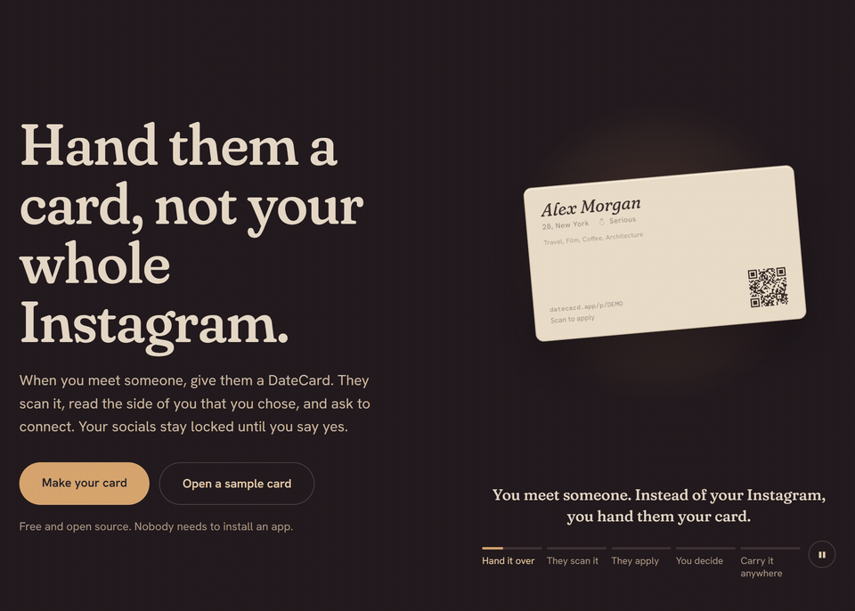
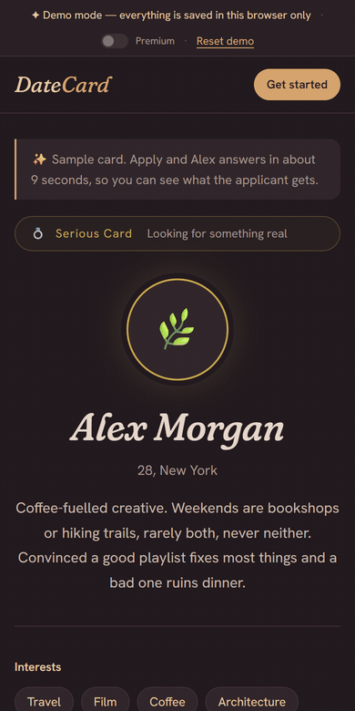
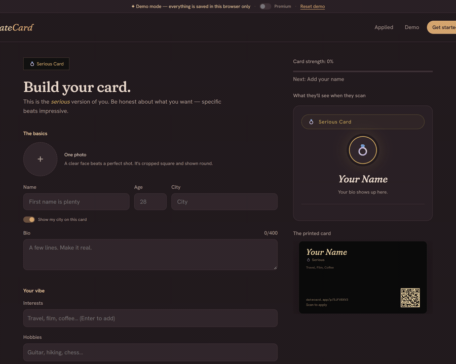
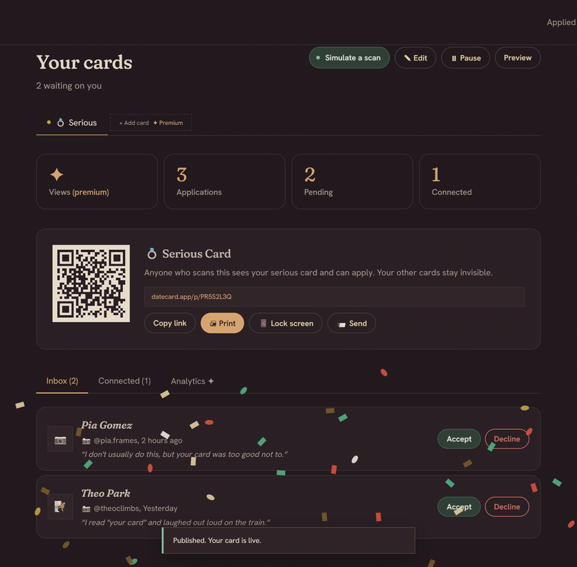

<div align="center">

# DateCard

**Hand them a card, not your whole Instagram.**

A QR code that routes interest to a private channel. They scan, they apply, you decide.<br>
Only then do they get your socials.

[](https://github.com/anki-boi/datecard/actions/workflows/ci.yml)


[Try it in 60 seconds](#try-it-in-60-seconds) ·
[Why it exists](#why-this-exists) ·
[Privacy](#privacy-enforced-by-the-database) ·
[Run it for real](#run-it-for-real)



</div>

## How it works

| 1. Hand it over | 2. They scan | 3. They apply | 4. You decide |
|---|---|---|---|
| A printed card, your lock screen, a story or an event badge. Each one carries a QR code. | No app to install. They read the side of you that you chose to show. | A short note, signed in with one tap so you know who it is. | Accept and your socials unlock for them. Decline and they see a polite "not this time". |

One account holds up to three cards, **Serious 💍 · Casual 🔥 · Friendship 🤝**, each with its own
link, QR code and inbox. Public pages never link your cards to each other.

## See it

<table>
<tr>
<td width="34%" valign="top">

### Be the stranger

Scan a sample card on your phone, read it, apply with a note. The sample owner accepts in about
nine seconds: confetti, their socials unlock, and three openers written from their own prompt
answers.

</td>
<td width="66%" align="center">

</td>
</tr>
</table>

### Build your card

A live preview and a card-strength meter update as you type. You only sign in when you hit
*Publish*.



### Run your inbox

Every application arrives with the applicant's name, platform and note. In demo mode,
**Simulate a scan** plays a stranger who reads your card and applies, quoting a line from it.



### Carry it anywhere

| Accepted, with openers | Lock screen | Dashboard |
|---|---|---|
|  |  |  |

*Print* gives a 10-up US Letter sheet with cut lines. *Lock screen* draws a phone wallpaper with
your QR, so your phone becomes the card. *Send* has Share, Messenger, WhatsApp, and PNG or SVG QR
files for print shops.

## Try it in 60 seconds

```bash
npm install
npm run dev
```

No credentials needed. Without Supabase keys the app runs in **demo mode**: a complete in-browser
backend, saved to `localStorage`, that plays both sides of the product.

1. **Be the stranger.** Open a sample card (Alex, Rae or Miko), hit *Apply to connect*, write a note,
   and watch it get accepted.
2. **Be the card holder.** *Make your card*, pick a type, build it beside the live preview, publish.
   Your new card arrives with a little history so the dashboard has something in it.
3. **Get scanned.** On the dashboard, hit **Simulate a scan**, then accept the applicant.
4. **Apply to yourself.** Preview your card, *Try applying as a stranger*, apply, accept yourself in
   the dashboard, and your status page reveals your own socials. The whole loop in one browser.
5. **Flip on Premium** in the demo bar to unlock all three cards, six designs and analytics (the
   scan, apply, accept funnel plus 14 days of views).

## Why this exists

**There's no good way to show someone who you are when you meet them in public.**

The offer is always "find me on Instagram", which is an all-or-nothing broadcast, not an
introduction. They don't get the person they just met; they get the last three years. There's no
way to hand over one side of yourself, and plenty of people have no public social presence at all.

Dating apps solve a different problem: they put you in front of *strangers*. When you've already
met someone in person, an app just re-introduces you through an algorithm neither of you needs.

DateCard replaces the handle with an exchange you control: **scan, read the card, apply, you
approve or decline, and only then do they get your socials.**

**[The full problem breakdown](PROBLEMS.md)** · **[The product spec](SPEC.md)**

## Privacy, enforced by the database

The whole idea collapses if scanning a card leaks your life, so the rules live in Postgres
(RLS plus `SECURITY DEFINER` functions), not just in the UI:

- **Socials are never in the public payload.** `get_public_profile()` returns everything except
  socials. `reveal_socials()` returns them only to the owner or an *accepted* applicant.
- **No cross-linking.** The public RPC doesn't return `owner_id`, so nobody can tie your serious
  card to your casual one. It tells the caller only `is_mine`.
- **Applications can't forge acceptance.** Inserts must be as yourself, `pending`, onto an active
  card you don't own. Only the owner can change status.
- **City on your terms.** Casual cards never expose a city; the others honour the toggle, stripped
  server-side.
- **Not Googleable.** Cards and status pages are `noindex` (meta tag *and* `X-Robots-Tag`), and
  `Referrer-Policy: no-referrer` keeps private status URLs from leaking through links.
- **No third parties.** QR codes and posters are drawn in your browser.

`scripts/live_test.py` attacks a live project (self-accept, impersonation, paused cards, anonymous
applies, cross-user writes) and prints PASS or FAIL for each.

## Run it for real

1. Create a free project at [supabase.com](https://supabase.com).
2. Run `supabase/schema.sql` in the SQL editor. It's idempotent, so **re-run it whenever you pull
   schema changes**.
3. Enable auth providers (Authentication, then Providers): **Google, Facebook, X/Twitter**.
   Supabase has no Instagram or TikTok provider.
4. Copy `.env.example` to `.env` and fill in `VITE_SUPABASE_URL` and `VITE_SUPABASE_ANON_KEY`.
5. Optional: `VITE_PUBLIC_URL` (the domain on printed cards), `VITE_UNLOCK_PREMIUM=true`
   (self-hosting), `VITE_GEMINI_API_KEY` (the AI writer; proxy it for production, see the spec).
6. `npm run dev`.

Sign-in uses OAuth redirects. Anything you'd typed (a half-built card, an application note) is
stashed in `sessionStorage` and restored when you land back.

### Deploy (free)

[](https://vercel.com/new/clone?repository-url=https://github.com/anki-boi/datecard)

Push to GitHub, import in Vercel, add the env vars. `vercel.json` handles SPA routing and the
privacy headers.

## Under the hood

- **Frontend:** Vite, React 18 and React Router. Mobile-first, a soft lamp-lit dark theme, Fraunces
  and Hanken Grotesk.
- **Backend:** Supabase (Postgres, Auth, Storage, RLS). The free tier is enough.
- **QR and posters:** `qrcode` plus canvas, all client-side.
- **AI (optional):** Gemini drafts your card from a six-question interview, and writes openers.

<details>
<summary><b>Project layout and routes</b></summary>

```
src/
  App.jsx              routes, nav, demo bar
  state.jsx            auth, cards, toasts, confetti
  pages/               Landing · CardEditor · Dashboard · Applicant (/p /a /me) · PrintSheet
  components/          HeroStory (landing storyboard) · cards (BizCard, ProfileBody) · ShareKit · ui
  lib/
    api.js             one API: demo.js (browser) or db.js (Supabase)
    demo.js            demo backend: same contract as the SQL, in localStorage
    samples.js         sample cards and simulated applicants
    openers.js         offline opener generator (seeded, quotes the card)
    poster.js          lock-screen and story canvas renderer
    qr.js, ai.js, util.js, constants.js, drafts.js
supabase/schema.sql    tables, RPCs, RLS, storage bucket; idempotent, re-run after pulls
scripts/live_test.py   end-to-end RLS attack suite against a live project
```

| Route | What |
|---|---|
| `/` | Landing |
| `/new`, `/new/:type`, `/edit/:type` | Choose a type, build or edit a card |
| `/dashboard?card=:type` | Inbox, QR, share kit, analytics |
| `/p/:cardId` | The public card: what a scan opens |
| `/a/:appId` | The applicant's private status page |
| `/me` | Everything you've applied to |
| `/print/:cardId?tpl=` | 10-up print sheet |

</details>

### Scripts

```bash
npm run dev       # dev server
npm test          # vitest: ids, visibility, openers, QR contrast, demo-store privacy contract
npm run build     # production build
python scripts/live_test.py   # RLS attack suite against a live Supabase project
```

## Roadmap

- [x] **P0, scaffold:** Vite, React and Supabase, demo-mode fallback, `/p/:cardId`, RLS schema
- [x] **P1, behavior contract:** applicant status page, pause and resume, per-card visibility, privacy defaults, AI card builder
- [x] **P1.5, playable demo and hardening:** full in-browser backend, card editing, photos (Storage), applicant "my applications", openers on accept, local QR, RLS fixes (self-accept, owner_id cross-linking), tests and CI
- [ ] **P2, hardening:** email on accept (Resend plus an edge function), AI key proxy, realtime inbox
- [ ] **P3, premium:** payments (Stripe), QR-as-key token activation
- [x] **P4 (early), PH launch kit:** print sheet, phone-wallpaper QR, Messenger and WhatsApp share
- [ ] A6 print-shop PDF

## License

MIT. Run it, fork it, self-host it. The software is unchained too.
