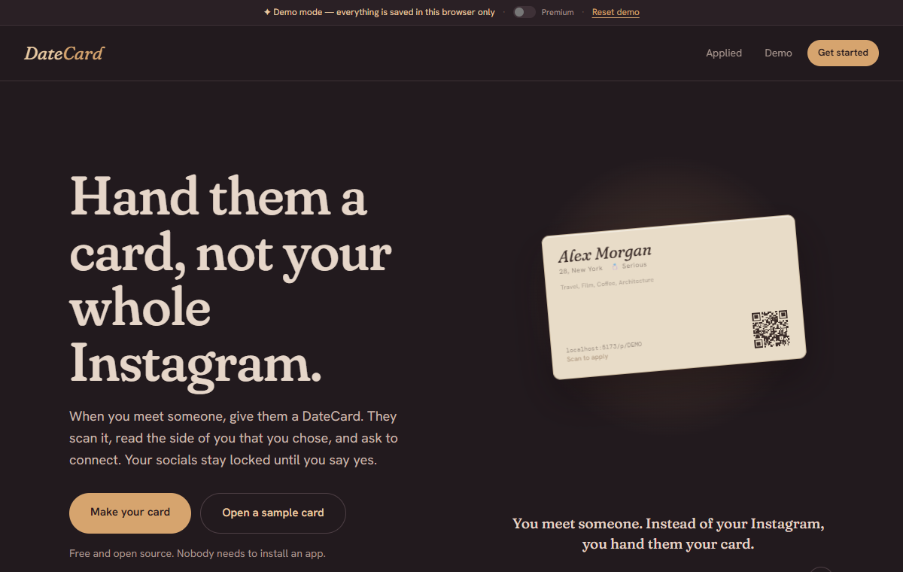
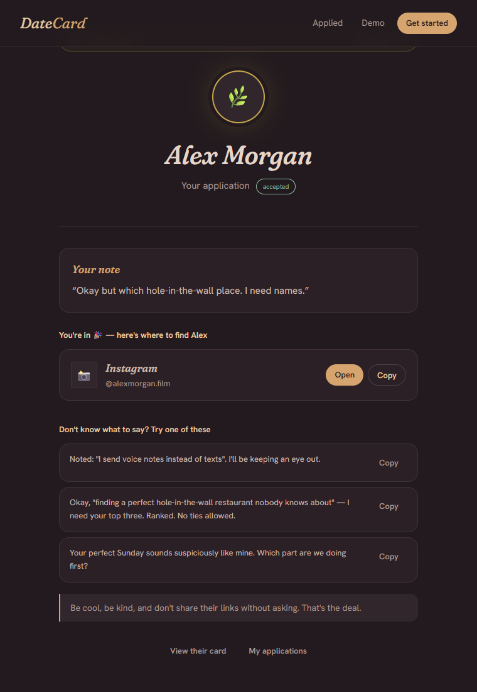
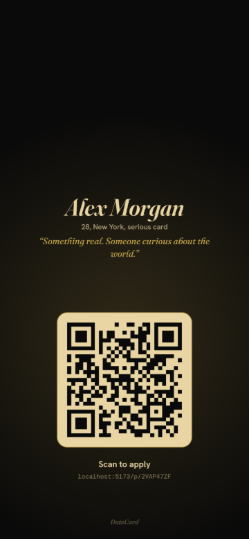
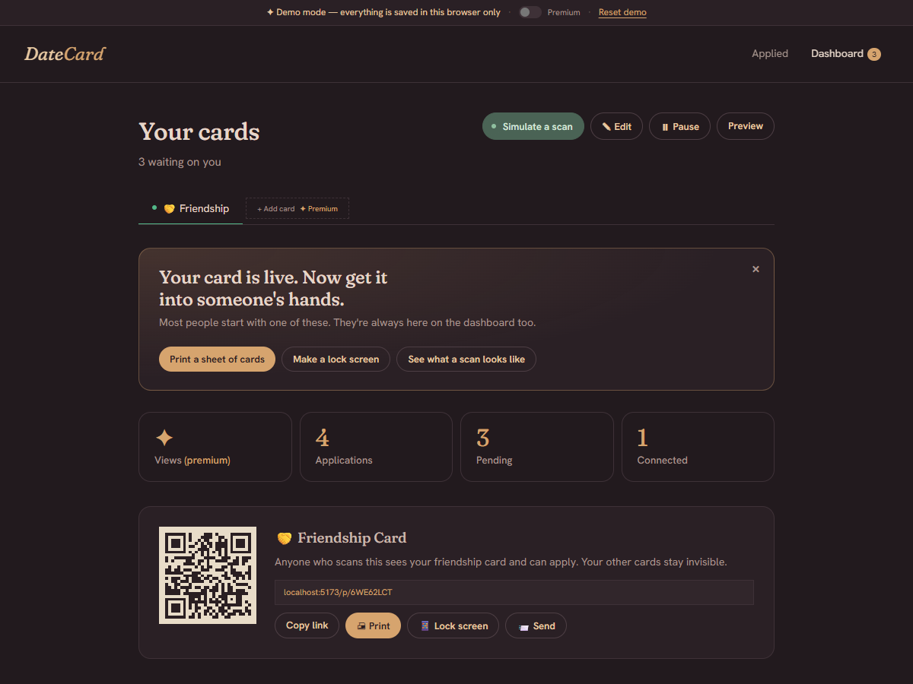

# DateCard

> Your dating profile, unchained.
> No app. No algorithm. Just a QR code — and the right people find you.

A dating résumé with a hiring process. You build a profile and get a link and a QR code.
Someone scans it, reads who you are, and **applies to connect**. You approve or decline.
Only then do they get your socials.

Open source (MIT). One account, up to three cards: **Serious 💍 · Casual / Spicy 🔥 · Friendship 🤝**,
each with its own link, QR code and inbox. Public pages never link cards to each other.



## Try it in 60 seconds

```bash
npm install
npm run dev
```

No credentials needed. Without Supabase keys the app runs in **demo mode**: a complete
in-browser backend, saved to `localStorage`, that plays both sides of the product.

The landing page opens with a short storyboard on a lamp-lit table: hand the card over →
they scan it → they apply → you decide → carry it anywhere (wallet, lock screen, story,
event badge). Chapters are clickable, it pauses off-screen, and it respects reduced motion.

1. **Be the stranger.** Open a sample card (Alex, Rae or Miko), hit *Apply to connect*,
   write a note. The sample owner "reads" it and accepts in about nine seconds — confetti,
   their socials unlock, and you get three openers written from their own prompt answers.
2. **Be the card holder.** *Make your card* → pick a type → build it while the live
   preview and card-strength meter update beside you. You only sign in when you hit
   *Publish*. Your new card arrives with a little history so the dashboard has something
   in it, plus a "hand it out" panel with the next steps.
3. **Get scanned.** On the dashboard, hit **Simulate a scan**. A stranger views your card
   and (usually) applies, quoting a line from it. Accept them and watch the toast.
4. **Apply to yourself.** Preview your card → *Try applying as a stranger* → apply →
   accept yourself in the dashboard → your status page reveals your own socials. The whole
   loop, one browser.
5. **Take it with you.** *Print* gives a 10-up US Letter sheet with cut lines. *Lock screen*
   draws a phone wallpaper with your QR (your phone becomes the card). *Send* has Share,
   Messenger, WhatsApp, and PNG/SVG QR files for print shops.
6. **Flip on Premium** in the demo bar to unlock all three cards, six designs and analytics
   (scan → apply → accept funnel plus 14 days of views).

| Accepted, with openers | Lock screen | Dashboard |
|---|---|---|
|  |  |  |

## Why this exists

**There's no good way to show someone who you are when you meet them in public.**

The exchange offer is always "find me on Instagram" — an all-or-nothing broadcast, not an
introduction. They don't get the person you just met; they get the last three years. There's
no way to hand over one side of yourself, and plenty of people have no public social presence
at all.

Dating apps solve a different problem: they put you in front of *strangers*. When you've
already met someone in person, an app just re-introduces you through an algorithm neither of
you needs.

DateCard replaces the handle with an exchange you control: **scan → read the card → apply →
you approve or decline → only then do they get your socials.**

**→ [Read the full problem breakdown](PROBLEMS.md)** · **[The product spec](SPEC.md)**

## Privacy, enforced by the database

The value proposition collapses if scanning a card leaks your life, so the rules live in
Postgres (RLS + `SECURITY DEFINER` functions), not just in the UI:

- **Socials are never in the public payload.** `get_public_profile()` returns everything
  except socials; `reveal_socials()` returns them only to the owner or an *accepted* applicant.
- **No cross-linking.** The public RPC doesn't return `owner_id`, so nobody can tie your
  serious card to your casual one. It tells the caller only `is_mine`.
- **Applications can't forge acceptance.** Inserts must be as yourself, `pending`, onto an
  active card you don't own. Only the owner can change status.
- **City on your terms.** Casual cards never expose a city; the others honour the toggle,
  stripped server-side.
- **Not Googleable.** Cards and status pages are `noindex` (meta tag *and* `X-Robots-Tag`),
  and `Referrer-Policy: no-referrer` keeps private status URLs from leaking through links.
- **No third parties.** QR codes and posters are drawn in your browser.

`scripts/live_test.py` attacks a live project (self-accept, impersonation, paused cards,
anonymous applies, cross-user writes) and prints PASS/FAIL for each.

## Stack

- **Frontend:** Vite + React 18 + React Router (mobile-first, a soft, lamp-lit dark theme; Fraunces + Hanken Grotesk)
- **Backend:** Supabase (Postgres + Auth + Storage + RLS). The free tier is enough.
- **QR / posters:** `qrcode` + canvas, all client-side
- **AI (optional):** Gemini drafts your card from a six-question interview, and writes openers

```
src/
  App.jsx              routes, nav, demo bar
  state.jsx            auth, cards, toasts, confetti
  pages/               Landing · CardEditor · Dashboard · Applicant (/p /a /me) · PrintSheet
  components/          HeroStory (landing storyboard) · cards (BizCard, ProfileBody) · ShareKit · ui
  lib/
    api.js             one API → demo.js (browser) or db.js (Supabase)
    demo.js            demo backend: same contract as the SQL, in localStorage
    samples.js         sample cards and simulated applicants
    openers.js         offline opener generator (seeded, quotes the card)
    poster.js          lock-screen / story canvas renderer
    qr.js, ai.js, util.js, constants.js, drafts.js
supabase/schema.sql    tables, RPCs, RLS, storage bucket — idempotent, re-run after pulls
scripts/live_test.py   end-to-end RLS attack suite against a live project
```

| Route | What |
|---|---|
| `/` | Landing |
| `/new`, `/new/:type`, `/edit/:type` | Choose a type, build or edit a card |
| `/dashboard?card=:type` | Inbox, QR, share kit, analytics |
| `/p/:cardId` | The public card — what a scan opens |
| `/a/:appId` | The applicant's private status page |
| `/me` | Everything you've applied to |
| `/print/:cardId?tpl=` | 10-up print sheet |

## Run it for real

1. Create a free project at [supabase.com](https://supabase.com).
2. Run `supabase/schema.sql` in the SQL editor. It's idempotent, so **re-run it whenever
   you pull schema changes**.
3. Enable auth providers (Authentication → Providers): **Google, Facebook, X/Twitter**.
   (Supabase has no Instagram or TikTok provider.)
4. Copy `.env.example` → `.env` and fill in `VITE_SUPABASE_URL` and `VITE_SUPABASE_ANON_KEY`.
5. Optional: `VITE_PUBLIC_URL` (the domain on printed cards), `VITE_UNLOCK_PREMIUM=true`
   (self-hosting), `VITE_GEMINI_API_KEY` (AI writer — proxy it for production, see SPEC).
6. `npm run dev`.

Sign-in uses OAuth redirects; anything you'd typed (a half-built card, an application note)
is stashed in `sessionStorage` and restored when you land back.

## Scripts

```bash
npm run dev       # dev server
npm test          # vitest: ids, visibility, openers, QR contrast, demo-store privacy contract
npm run build     # production build
python scripts/live_test.py   # RLS attack suite against a live Supabase project
```

## Deploy (free)

[](https://vercel.com/new/clone?repository-url=https://github.com/anki-boi/datecard)

Push to GitHub → import in Vercel → add the env vars → done. `vercel.json` handles SPA
routing and the privacy headers.

## Roadmap

- [x] **P0 — Scaffold:** Vite + React + Supabase, demo-mode fallback, `/p/:cardId`, RLS schema
- [x] **P1 — Behavior contract:** applicant status page, pause/resume, per-card visibility, privacy defaults, AI card builder
- [x] **P1.5 — Playable demo & hardening:** full in-browser backend, card editing, photos (Storage), applicant "my applications", openers on accept, local QR, RLS fixes (self-accept, owner_id cross-linking), tests + CI
- [ ] **P2 — Hardening:** email on accept (Resend + edge function), AI key proxy, realtime inbox
- [ ] **P3 — Premium:** payments (Stripe), QR-as-key token activation
- [x] **P4 (early) — PH launch kit:** print sheet, phone-wallpaper QR, Messenger/WhatsApp share · [ ] A6 print-shop PDF

## License

MIT — run it, fork it, self-host it. The software is unchained too.
